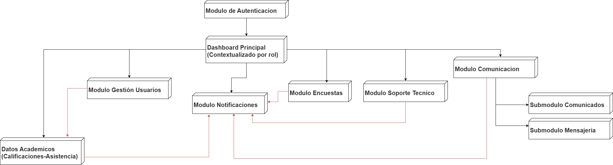

# **Arquitectura Funcional - Frontend**
## **Plataforma de Comunicación y Seguimiento Académico**

**Institución:** I.E.P. Las Orquídeas  
**Fecha:** Semana 1 - 2025  
**Versión:** 1.0 - Diseño Funcional  

---

## **1. MÓDULOS PRINCIPALES DEL FRONTEND**

### **1.1 Módulo de Autenticación**
**Propósito:** Control de acceso y gestión de sesiones de usuarios.

**Componentes principales:**
- **Pantalla de Login:** Validación de credenciales y redirección por roles
- **Recuperación de Contraseña:** Solicitud y cambio de contraseña con token
- **Cambio de Contraseña:** Para docentes en primer acceso
- **Gestión de Sesiones:** Control de tokens JWT y logout automático

**Funcionalidades específicas:**
- Validación de formularios en tiempo real
- Redirección automática según rol de usuario
- Manejo de errores de autenticación
- Interfaz de recuperación por whatsapp

---

### **1.2 Módulo de Dashboard Principal**
**Propósito:** Centro de navegación personalizado según el rol del usuario.

**Componentes por rol:**

**Dashboard Padre:**
- **Selector de Hijo:** Dropdown en header que cambia todo el contexto
- **Resumen Académico:** Vista rápida de calificaciones y asistencia actual
- **Notificaciones Recientes:** Alertas y avisos no leídos
- **Accesos Rápidos:** Navegación a módulos principales
- **Panel de Comunicación:** Mensajes pendientes y comunicados nuevos

**Dashboard Docente:**
- **Mis Asignaciones:** Cursos y grados asignados
- **Carga de Datos:** Acceso directo a subida de calificaciones/asistencia
- **Comunicación:** Mensajes recibidos y herramientas de comunicado
- **Permisos Activos:** Visualización de permisos otorgados por el director

**Dashboard Director:**
- **Vista General:** Métricas institucionales y actividad del sistema
- **Gestión de Permisos:** Panel para otorgar/revocar permisos a docentes
- **Supervisión:** Acceso a herramientas de monitoreo y reportes
- **Configuración:** Acceso a estructura de evaluación y parámetros

**Dashboard Administrador:**
- **Gestión de Usuarios:** Estado del sistema y usuarios activos
- **Soporte Técnico:** Panel de tickets pendientes y en proceso
- **Configuración Sistema:** Parámetros técnicos y exportación de datos

---

### **1.3 Módulo de Datos Académicos**
**Propósito:** Consulta y gestión de calificaciones y asistencia de estudiantes.

**Componentes principales:**

**Visualización de Calificaciones (Padres):**
- **Tabla por Curso:** Vista detallada con 5 componentes por trimestre
- **Filtros Dinámicos:** Por año académico, trimestre, curso
- **Toggle Numérico/Letras:** Alternancia entre escalas 0-20 y AD/A/B/C
- **Histórico Multi-año:** Acceso a calificaciones de años anteriores
- **Estado de Calificaciones:** Diferenciación visual entre preliminar/final

**Carga de Calificaciones (Docentes/Director):**
- **Selección de Contexto:** Nivel → Grado → Curso (paso obligatorio)
- **Subida de Archivos:** Interfaz de drag & drop con validación
- **Plantillas Descargables:** Acceso a formatos exactos requeridos
- **Reporte de Errores:** Visualización de errores de procesamiento
- **Confirmación de Carga:** Feedback visual de éxito/fallo

**Visualización de Asistencia (Padres):**
- **Calendario Visual:** Vista mensual con códigos de colores por estado
- **Filtros por Fecha:** Navegación por meses y trimestres
- **Detalle de Estados:** Información específica por día
- **Estadísticas de Asistencia:** Porcentajes y resúmenes por período

**Carga de Asistencia (Docentes/Director):**
- **Proceso Similar a Calificaciones:** Selección de contexto + subida
- **Validación de Fechas:** Control de fechas duplicadas o inválidas
- **Estados Específicos:** Interfaz para los 5 estados definidos

---

### **1.4 Módulo de Comunicación**
**Propósito:** Facilitar la comunicación bidireccional entre todos los actores.
- El modulo agrupa dos submodulos: **Mensajeria** y **Comunicados**
 > **Razon**: Ambos cumplen el mismo propósito central: transmitir información entre la institución y las familias. La mensajería cubre la comunicación personalizada y bidireccional (padre ↔ docente/director), mientras que los comunicados garantizan la difusión masiva y unidireccional de información oficial. Al integrarlos en un solo módulo, se mantiene la coherencia funcional y se simplifica la experiencia del usuario, quien identifica la comunicación como un único ámbito dentro de la plataforma.

**Componentes principales:**

**Sistema de Mensajería:**
- **Lista de Conversaciones:** Agrupadas por estudiante con estados de lectura
- **Interface de Chat:** Conversación lineal con historial completo
- **Redacción de Mensajes:** Editor con soporte para archivos adjuntos
- **Gestión de Archivos:** Subida, previsualización y descarga de adjuntos
- **Búsqueda de Conversaciones:** Filtros por participantes, fecha, estado

**Supervisión de Mensajería (Director):**
- **Vista de Solo Lectura:** Acceso completo sin capacidad de edición
- **Filtros Avanzados:** Por participantes, fechas, asuntos
- **Panel de Reportes:** Estadísticas de comunicación institucional

**Comunicados Institucionales:**
- **Vista de Comunicados:** Lista filtrable con estados de lectura
- **Creación de Comunicados (Docentes/Director):** Editor enriquecido con segmentación
- **Gestión de Audiencia:** Selección específica por grado/nivel/rol
- **Preview y Programación:** Vista previa antes de publicar
- **Indicadores de Edición:** Marcas visuales de comunicados modificados

---

### **1.5 Módulo de Encuestas**
**Propósito:** Recolección estructurada de feedback institucional.

**Componentes principales:**

**Vista de Encuestas (Todos los usuarios):**
- **Panel de Encuestas Activas:** Tarjetas con información resumida
- **Estados Visuales:** Pendiente, respondida, vencida con códigos de colores
- **Formulario de Respuesta:** Interface dinámica según tipos de pregunta
- **Bloqueo Post-respuesta:** Prevención de respuestas múltiples

**Creación de Encuestas (Docentes/Director):**
- **Constructor de Encuestas:** Editor drag & drop para diferentes tipos de preguntas
- **Tipos de Preguntas Soportadas:** Texto corto/largo, opción única/múltiple, escala 1-5
- **Configuración de Audiencia:** Segmentación similar a comunicados
- **Programación de Fechas:** Inicio y vencimiento de encuestas

**Análisis de Resultados (Creadores):**
- **Dashboard de Resultados:** Visualizaciones automáticas por tipo de pregunta
- **Gráficos Interactivos:** Barras, pasteles, columnas según corresponda
- **Exportación de Datos:** CSV para análisis externo
- **Segmentación de Respuestas:** Análisis por grado/nivel

---

### **1.6 Módulo de Notificaciones**
**Propósito:** Sistema de alertas y avisos en tiempo real.

**Componentes principales:**

**Centro de Notificaciones:**
- **Panel Principal:** Lista cronológica de notificaciones recibidas
- **Filtros por Tipo:** Asistencia, calificaciones, mensajes, comunicados, sistema
- **Estados de Lectura:** Visual diferenciado entre leídas/no leídas
- **Acciones Directas:** Enlaces a elementos relacionados
- **Historial Completo:** Acceso a notificaciones anteriores

**Configuración de Alertas (Director):**
- **Umbrales de Alertas:** Configuración de parámetros críticos
- **Tipos de Notificaciones:** Habilitación/deshabilitación por categoría
- **Canales de Entrega:** Configuración de WhatsApp vs. Plataforma

---

### **1.7 Módulo de Soporte Técnico**
**Propósito:** Asistencia técnica estructurada y autoayuda.

**Componentes principales:**

**Centro de Ayuda:**
- **FAQ Interactivo:** Preguntas frecuentes organizadas por categorías
- **Guías Paso a Paso:** Documentos PDF con capturas de pantalla
- **Búsqueda de Ayuda:** Motor de búsqueda en contenido de ayuda

**Sistema de Tickets:**
- **Creación de Tickets:** Formulario estructurado con categorías y prioridades
- **Seguimiento de Solicitudes:** Vista del historial personal de tickets
- **Conversación por Ticket:** Chat estructurado con soporte técnico
- **Estados y Notificaciones:** Actualizaciones automáticas de progreso

**Panel Administrativo (Administrador):**
- **Gestión de Tickets:** Organización por estados y prioridades
- **Métricas de Soporte:** SLA, satisfacción, categorías frecuentes
- **Base de Conocimiento:** Gestión de FAQ y guías

---

### **1.8 Módulo de Gestión de Usuarios** (Director/Administrador)
**Propósito:** Administración de usuarios y permisos del sistema.

**Componentes principales:**

**Gestión de Permisos (Director):**
- **Panel de Docentes:** Lista con permisos actuales por docente
- **Asignación Granular:** Interface para otorgar permisos por grado/nivel
- **Gestión de Comunicados:** Control de quién puede crear comunicados
- **Gestión de Encuestas:** Control de quién puede crear encuestas

**Configuración del Sistema (Director):**
- **Estructura de Evaluación:** Definición de componentes y pesos
- **Umbrales de Alertas:** Configuración de parámetros críticos
- **Períodos Académicos:** Gestión de trimestres y año académico

---
## 2. **Clasificacion Modulos Core y Modulos Complementarios**
 
La plataforma se organiza en **módulos funcionales** que estructuran el acceso y la interacción de los diferentes roles de usuario. 
Para el diseño funcional, se clasifican en **Core (esenciales para el MVP)** y **Complementarios (de apoyo o administración avanzada)**.

---

### 2.1 Módulos Core (Esenciales para el MVP)

Estos módulos responden directamente al **objetivo central del sistema**: garantizar el **seguimiento académico** y la **comunicación efectiva** entre padres, docentes y la institución.

1. **Autenticación**

   * Control de acceso seguro al sistema.
   * Manejo de credenciales y gestión de sesiones.
   * Redirección automática según rol.

2. **Datos Académicos (Calificaciones y Asistencia)**

   * Consulta de calificaciones y asistencia por padres.
   * Carga masiva de notas y asistencia por docentes y director.
   * Históricos multi-año con filtros dinámicos.

3. **Comunicación (Mensajería + Comunicados)**

   * **Mensajería:** intercambio directo padre-docente/director con historial conversacional.
   * **Comunicados:** publicación de avisos institucionales segmentados por grado, nivel o rol.
   * Supervisión del director con acceso en modo lectura.

4. **Encuestas**

   * Creación de encuestas por docentes/director.
   * Distribución segmentada por audiencia.
   * Respuesta única por usuario con análisis básico de resultados.

5. **Soporte Técnico**

   * Centro de ayuda con preguntas frecuentes y guías paso a paso.
   * Sistema de tickets para incidencias técnicas.
   * Gestión de solicitudes por el administrador del sistema.

6. **Notificaciones**

   * Alertas inmediatas en plataforma y WhatsApp.
   * Configuración de umbrales críticos (asistencia, calificaciones).
   * Historial completo de notificaciones por usuario.

---

### 2.2 Módulos Complementarios

Son módulos que **enriquecen la experiencia** y facilitan la **administración de la plataforma**, pero no son imprescindibles para el MVP inicial.

1. **Dashboard**

   * Vista inicial personalizada según rol (Padre, Docente, Director, Administrador).
   * Resúmenes rápidos, accesos directos y métricas básicas.

2. **Gestión de Usuarios y Permisos**

   * Creación y vinculación de usuarios por parte del administrador.
   * Asignación granular de permisos a docentes (por nivel y grado).
   * Configuración de la estructura de evaluación académica y períodos.

---

## **3. CONEXIONES ENTRE MÓDULOS**

### **3.1 Dependencias Críticas**

* **Autenticación → Todos los módulos**
  Es la puerta de entrada. Define quién eres, qué puedes ver y qué puedes hacer. Si la sesión vence, te redirige al login.

* **Dashboard → Todos los módulos**
  Es el “centro de mando”. Resume información clave de otros módulos y te da accesos rápidos según tu rol.

* **Gestión de Usuarios → Datos Académicos**
  El directo define la estructura de evaluación que se usará en todas las calificaciones.

   **Gestión de Usuarios → Encuestas**
  Los permisos que define el director influencia sobre quienes crean encuestas.

   **Gestión de Usuarios → Comunicados**
  Los permisos que define el director influencia sobre quienes crean comunicados.

* **Datos Académicos → Notificaciones**
  Cada vez que se cargan notas o asistencia, el sistema genera alertas automáticas para los padres (según reglas de umbral).

* **Comunicación → Notificaciones**
  Cuando se envía un mensaje o se publica un comunicado, los destinatarios reciben un aviso inmediato.

* **Encuestas → Comunicación**
  Se aprovecha el mismo sistema de segmentación (por grado, nivel, rol) para distribuir encuestas. Además, se notifican automáticamente las encuestas nuevas o vencidas.

* **Soporte Técnico → Notificaciones**
  Cada vez que se crea un ticket, se actualiza su estado o recibe una respuesta, se envía una notificación al usuario correspondiente.

* **Encuestas → Notificaciones**
  Cada vez que se crea una encuesta, se envía una notificación al usuario correspondiente para que la responda.

## **DIAGRAMA DE ARQUITECTURA FUNCIONAL**

### **3.2 Flujos de Datos Principales**

1. **Autenticación**
   Usuario ingresa credenciales → Validación de documento + contraseña → Generación de sesión JWT → Redirección a dashboard correspondiente.

2. **Calificaciones**
   Docente carga notas → Validación de archivo/plantilla → Registro en base → Cálculo de promedios → Generación de alertas → Notificación a padres → Visualización en dashboard.

3. **Asistencia**
   Docente carga asistencia (manual o archivo) → Validación de fechas y estados → Registro en base → Cálculo de porcentajes → Notificación automática si hay ausencias recurrentes → Visualización en dashboard de padres.

4. **Comunicación (Mensajería)**
   Padre/Docente redacta mensaje → Validación de permisos → Registro en base → Notificación al destinatario → Actualización de conversación en bandeja de ambos.

5. **Comunicación (Comunicados)**
   Director/Docente autorizado crea comunicado → Selección de audiencia → Registro en base → Publicación inmediata o programada → Notificación a destinatarios → Visualización en panel de comunicados.

6. **Encuestas**
   Director/Docente autorizado crea encuesta → Registro en base en formato JSON → Notificación a la audiencia → Usuario responde → Registro de respuestas → Creador accede a análisis y gráficos.

7. **Notificaciones**
   Evento (nota cargada, ausencia, mensaje, comunicado, encuesta, ticket) → Motor de notificaciones → Generación de aviso en plataforma + WhatsApp (según configuración) → Registro histórico de notificaciones por usuario.

8. **Soporte Técnico**
   Usuario crea ticket → Registro en base → Administrador recibe en bandeja → Admin responde o cambia estado → Notificación automática → Usuario consulta seguimiento en su panel de soporte.

9. **Gestión de Usuarios**
   Director/Administrador edita usuario → Asigna roles y permisos → Se guardan relaciones en entidades (ej. asignaciones\_docente\_curso) → Cambios se reflejan en accesos y vistas de otros módulos.

---
## **4. ORDEN DE USO POR TIPO DE USUARIO**

### **4.1 Padre o Apoderado**

**Primer acceso:**

1. **Login** con credenciales iniciales.
2. **Dashboard Principal**, con selector de hijo si aplica.
3. **Consulta Académica**: notas y asistencia actuales.
4. **Notificaciones**, para revisar alertas pendientes.
5. **Comunicación**, lectura de comunicados y mensajes recibidos.

**Uso habitual:**

1. Ingreso directo con **login**.
2. Revisión de **novedades en el dashboard** (cambio de hijo si corresponde).
3. Consulta de **notificaciones nuevas**.
4. Acceso a **detalles de notas/asistencia** si hay alertas.
5. Uso de **mensajería y comunicados** para mantenerse informado.
6. **Soporte técnico** solo en caso de incidencias.

---

### **4.2 Docente**

**Primer acceso:**

1. **Login** con cambio de contraseña obligatorio.
2. **Dashboard Docente** con asignaciones y permisos activos.
3. **Revisión de permisos** (qué puede cargar o comunicar).
4. Exploración del módulo de **Datos Académicos**.

**Uso habitual:**

1. **Login**.
2. **Dashboard** para ver tareas pendientes y mensajes.
3. **Carga de datos académicos** (notas y asistencia).
4. **Mensajería** para responder consultas de padres.
5. **Creación de comunicados o encuestas**, si tiene permisos.

**Flujo específico de carga de datos:**

1. Selección de **contexto** (nivel/grado/curso).
2. **Descarga de plantilla** (Excel).
3. **Llenado externo** de la plantilla.
4. **Subida al sistema**.
5. **Validación de errores**.
6. **Confirmación final** de la carga.

---

### **4.3 Director**

**Configuración inicial del año:**

1. **Login**.
2. **Gestión de Usuarios** → Definición de estructura de evaluación.
3. **Asignación de permisos a docentes**.
4. **Dashboard** para verificar configuración completa.

**Uso habitual:**

1. **Login**.
2. **Dashboard** para métricas institucionales.
3. **Supervisión de mensajería** entre padres y docentes.
4. **Revisión de datos académicos** y alertas automáticas.
5. Ajustes en **permisos** si es necesario.

**Funciones específicas:**

* Emisión de **comunicados institucionales**.
* **Análisis de encuestas** institucionales.
* **Revisión/cierre** de notas por trimestre.
* Configuración de **umbrales de alertas**.

---

### **4.4 Administrador**

**Mantenimiento inicial:**

1. **Login** como administrador.
2. **Soporte Técnico**: revisión de tickets abiertos.
3. **Gestión de Usuarios**: creación masiva/importación de usuarios.
4. **Dashboard**: estado general del sistema.

**Uso habitual:**

1. **Login**.
2. **Soporte Técnico**: atención de tickets por prioridad.
3. **Gestión de Usuarios**: resolución de accesos o permisos.
4. **Configuración técnica** según necesidades.

