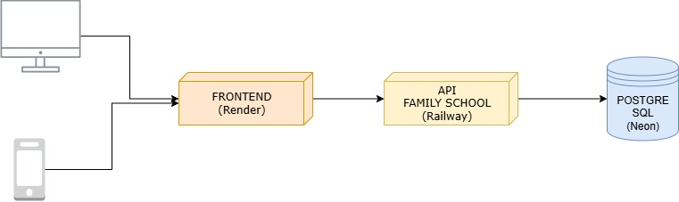

# Arquitectura y Stack

## **1. ARQUITECTURA GENERAL**

### **1.1 Patrón Arquitectónico Principal**

**Arquitectura Cliente-Servidor con API REST**

- **Separación Frontend-Backend:** Arquitectura desacoplada con comunicación vía API REST
- **Single Page Application (SPA):** Frontend como aplicación de página única con React
- **API-First Design:** Backend diseñado como API REST pura, sin renderizado de vistas
- **Stateless Backend:** Servidor sin estado con autenticación via JWT
- **Responsive Design:** Interfaz mobile-first con Progressive Web App (PWA) capabilities

### **1.2 Patrones de Desarrollo**

**Frontend: Patrón MVC Adaptado**

- **Model:** React Query para estado del servidor + Context API para estado global
- **View:** Componentes React funcionales con Tailwind CSS
- **Controller:** Custom hooks y servicios para lógica de negocio

**Backend: Patrón MVC Clásico**

- **Model:** Prisma ORM con PostgreSQL
- **View:** Respuestas JSON estructuradas
- **Controller:** Express.js controllers con middleware personalizado



---

## **2. STACK TECNOLÓGICO FRONTEND**

### **2.1 Core Technologies**

| Tecnología | Propósito | Justificación |
| --- | --- | --- |
| **Vite** | Build Tool & Dev Server | Build ultrarrápido, HMR eficiente, optimizado para React |
| **React** | Library UI | Ecosistema maduro, hooks, componentes funcionales |
| **JavaScript** | Lenguaje Principal | Flexibilidad, no requiere compilación adicional |
| **Tailwind CSS** | Framework CSS | Utility-first, responsive design, customización fácil |

### **2.2 Gestión de Estado y Datos**

| Tecnología | Propósito | Uso Específico |
| --- | --- | --- |
| **React Query** | Estado del Servidor | Cache, sincronización, refetch automático de datos API |
| **Context API** | Estado Global | Autenticación, usuario actual, configuración global |
| **React Hook Form** | Formularios | Validación, manejo de inputs, performance optimizada |
| **React Spinner** | Loading States | Feedback visual durante cargas y transiciones |

### **2.3 Navegación y Enrutamiento**

| Tecnología | Propósito | Configuración |
| --- | --- | --- |
| **React Router** | SPA Routing | Rutas protegidas, lazy loading, parámetros dinámicos |
| **Route Guards** | Protección de Rutas | Middleware de autenticación por rol |

### **2.4 UI/UX y Componentes**

| Tecnología | Propósito | Uso Específico |
| --- | --- | --- |
| **React Icons** | Iconografía | Lucide, Heroicons para interfaz consistente |
| **React Dropzone** | Upload de Archivos | Drag & drop para Excel/CSV, validación de tipos |
| **Notyf (Toast)** | Feedback UI | Notificaciones, alertas, confirmaciones de acciones |

### **2.5 Comunicación con Backend**

| Tecnología | Propósito | Implementación |
| --- | --- | --- |
| **Fetch API** | HTTP Client | Llamadas REST nativas con interceptors custom |
| **React Query** | Cache & Sync | Invalidación inteligente, refetch automático |
|Helmet | Security |Middleware para configurar cabeceras de seguridad HTTP |
---

## **3. STACK TECNOLÓGICO BACKEND**

### **3.1 Core Technologies**

| Tecnología | Propósito | Justificación |
| --- | --- | --- |
| **Node.js** | Runtime | Performance, ecosistema NPM, JavaScript full-stack |
| **Express.js** | Web Framework | Minimalista, middleware robusto, REST API optimizado |

### **3.2 Base de Datos y ORM**

| Tecnología | Propósito | Configuración |
| --- | --- | --- |
| **PostgreSQL** | Base de Datos | Hosted en Neon, SSL habilitado, backups automáticos |
| **Prisma ORM** | Database Toolkit | Migrations, type-safety, query builder optimizado |

### **3.3 Manejo de Archivos**

| Tecnología | Propósito | Implementación |
| --- | --- | --- |
| **Multer** | File Upload | Middleware para archivos Excel/CSV, validación MIME |
| **Cloudinary** | Storage | CDN para archivos adjuntos (PDF, JPG, PNG) |

### **3.4 Seguridad y CORS**

| Tecnología | Propósito | Configuración |
| --- | --- | --- |
| **CORS** | Cross-Origin | Whitelist de dominios, headers específicos |
| **bcrypt** | Hash Passwords | Salt rounds configurables, validación segura |
| **JWT** | Autenticación | Tokens con expiración, refresh token strategy |

### **3.5 Logging y Monitoreo**

| Tecnología | Propósito | Implementación |
| --- | --- | --- |
| **Winston** | Logging | Logs estructurados, niveles configurables, rotación |

### **3.6 Servicios Externos**

| Servicio | Propósito | Integración |
| --- | --- | --- |
| **Meta WhatsApp Cloud API** | Notificaciones | Webhook + REST API para mensajes automáticos |
| **Neon PostgreSQL** | Database Hosting | Serverless, auto-scaling, backups automáticos |

### **4.1 Testing**

| Tecnología | Propósito | Justificación |
| --- | --- | --- |
| **Vitest** | **Test Runner** (Frontend/Backend) y **Motor de Asersión** | Es el *test runner* moderno que ofrece **velocidad superior** debido a su integración nativa con **Vite**.  |
| **Supertest** | **Testing de Integración Backend** (API) | Herramienta clave para simular **peticiones HTTP** (GET, POST, etc.) a tus *endpoints* de Node.js.  |
| **React Testing Library (RTL)** | **Testing de Componentes Frontend** (React) | Se centra en el **comportamiento del usuario** (cómo el usuario vería e interactuaría con el componente). |
| **MSW (Mock Service Worker)** | API Mocking | Mocks realistas para testing de integración |

### **4.2 Validación de Datos**

| Tecnología | Propósito | Implementación |
| --- | --- | --- |
| **Zod** | Schema Validation | Frontend y backend, type-safety, validación consistente |

### **4.3 Utilidades Adicionales**

| Tecnología | Propósito | Uso Específico |
| --- | --- | --- |
| **date-fns** | Manipulación de Fechas | Filtros de calendarios, formateo de fechas académicas |
| **clsx** | Conditional Classes | Tailwind CSS condicional, estados dinámicos |
| **uuid** |  Generar identificadores universalmente únicos (UUID) | Para generar tokens |

### **4.4 Development Tools**

| Tecnología | Propósito | Beneficio |
| --- | --- | --- |
| **ESLint** | Code Linting | Consistencia de código, detección de errores |
| **Prettier** | Code Formatting | Formateo automático, estilo consistente |
| **Husky** | Git Hooks | Pre-commit hooks, calidad de código |

---

## **5. DIAGRAMA DE COMPONENTE**

.svg)

---

## **6. ARQUITECTURA DE CAPAS DETALLADA**

### **6.1 Frontend - Arquitectura en Capas**

### 1. PRESENTATION LAYER (Capa de Presentación)

Se encarga de todo lo que el usuario ve e interactúa. Es la interfaz de usuario (UI).

- **React Components:** Las páginas y componentes visuales de la aplicación.
- **Tailwind CSS Styling:** Uso de utilidades CSS para el diseño y la apariencia.
- **React Router Navigation:** Manejo del enrutamiento y la navegación entre distintas vistas de la aplicación.
- **Progressive Web App Features:** Funcionalidades que permiten que la aplicación funcione como una PWA (por ejemplo, *offline* o instalación en el escritorio).

### 2. LOGIC LAYER (Capa de Lógica)

Contiene las reglas de negocio, la validación y la gestión del estado local. Actúa como el puente entre la interfaz y los datos.

- **Custom Hooks:** Lógica reutilizable y encapsulada que maneja el comportamiento y el estado de componentes.
- **React Hook Form Validation:** Manejo de la validación compleja de formularios.
- **Business Logic Services:** Servicios dedicados que implementan las reglas de negocio específicas de la aplicación.
- **State Management (Context API):** Manejo del estado global de la aplicación.

### 3. DATA LAYER (Capa de Datos)

Responsable de la comunicación con fuentes de datos externas (como APIs de backend) y la gestión del estado del servidor.

- **React Query (Server State):** Herramienta para gestionar el estado asíncrono del servidor (fetching, caching, sincronización y actualización).
- **Fetch API HTTP Client:** Cliente HTTP utilizado para realizar las peticiones al backend.
- **Cache Management:** Estrategias para almacenar temporalmente los datos recuperados, mejorando el rendimiento y la experiencia del usuario.
- **API Integration Services:** Servicios específicos dedicados a interactuar con las distintas APIs del backend.

### **6.2 Backend - Arquitectura MVC**

Esta estructura define cómo un servidor procesa las peticiones, aplica la lógica de negocio y gestiona la persistencia de datos.

### 1. MIDDLEWARE LAYER (Capa Intermedia)

Es la primera capa que intercepta las peticiones entrantes. Se encarga de funciones transversales antes de que la petición llegue al controlador.

- **CORS Configuration:** Gestiona los permisos de recursos para peticiones entre diferentes dominios (permite que el frontend se comunique con el backend).
- **JWT Authentication:** Verifica y valida el *token* de autenticación (JSON Web Token) en la cabecera de la petición para asegurar que el usuario está logeado y tiene los permisos adecuados.
- **Multer File Upload:** Middleware específico para el manejo de la subida de archivos (*multipart/form-data*).
- **Winston Logging:** Registra (*loggea*) información de la aplicación (errores, advertencias, info) para monitoreo y depuración.
- **Error Handling:** Captura y estandariza las respuestas de error en la aplicación.

### 2. CONTROLLER LAYER (Capa de Control)

Se encarga de recibir la petición del cliente y de coordinar la respuesta. Es el punto de entrada para el flujo de la aplicación.

- **Request/Response Handling:** Recibe y procesa los datos de la petición (cuerpo, parámetros) y prepara la respuesta final al cliente.
- **Route Definitions:** Define las rutas (*endpoints*) de la API (ej. `GET /usuarios`, `POST /productos`).
- **Input Validation:** Valida los datos de entrada del usuario para asegurar que son correctos y seguros antes de pasarlos a la lógica de negocio.
- **HTTP Status Management:** Gestiona los códigos de estado HTTP apropiados para cada respuesta (ej. `200 OK`, `201 Created`, `404 Not Found`).

### 3. SERVICE LAYER (Capa de Servicios)

Contiene la **lógica de negocio** pura de la aplicación. Su función es ser independiente del transporte (controladores) y del almacenamiento (modelos).

- **Business Logic:** Implementa las reglas complejas y los flujos de trabajo de la aplicación (ej. calcular descuentos, procesar un pedido).
- **External API Integration:** Se comunica con servicios externos de terceros (ej. pasarelas de pago, servicios de mapas).
- **File Processing:** Lógica para manipular archivos (ej. redimensionar imágenes, generar PDFs).
- **Notification Services:** Gestiona el envío de correos electrónicos, SMS o notificaciones *push*.

### 4. MODEL LAYER (Capa de Modelo / Persistencia)

Se encarga de interactuar directamente con la base de datos.

- **Prisma ORM:** Utiliza un *Object-Relational Mapper* (ORM) para interactuar con la base de datos a través de objetos, en lugar de código SQL puro.
- **Database Queries:** Lógica para consultar, insertar, actualizar y eliminar datos.
- **Schema Definitions:** Define la estructura de las tablas y las relaciones en la base de datos.
- **Data Validation:** Validación final de los datos a nivel de la base de datos.

---

## **7. CONFIGURACIÓN DE DESARROLLO**

### **7.1 Estructura de Proyecto Frontend**

```
proyecto-orquideas/
├── frontend/                 # React SPA
│   ├── src/
│   │   ├── components/      # Componentes reutilizables
│   │   ├── pages/          # Páginas principales
│   │   ├── hooks/          # Custom hooks
│   │   ├── services/       # API calls
│   │   ├── context/        # Context providers
│   │   ├── utils/          # Utilidades
│   │   └── assets/         # Recursos estáticos
│   ├── public/             # PWA assets
│   └── package.json        # Dependencias frontend
└── docs/                   # Documentación
```

### **7.2 Estructura de Proyecto Backend**

```
proyecto-orquideas/
├── backend/                 # Express API
│   ├── src/
│   │   ├── controllers/    # Express controllers
│   │   ├── services/       # Business logic
│   │   ├── models/         # Prisma schemas
│   │   ├── middleware/     # Custom middleware
│   │   ├── routes/         # API routes
│   │   └── utils/          # Utilidades backend
│   ├── prisma/             # Database schema
│   └── package.json        # Dependencias backend
└── docs/                   # Documentación

```

---

## **8. SEGURIDAD**

### **8.1 Frontend Security**

- **XSS Protection:** Sanitización de inputs
- **CSRF Protection:** JWT en headers
- **Secure Storage:** JWT en memory only
- **Input Validation:** React Hook Form + Zod

### **8.2 Backend Security**

- **Authentication:** JWT con expiración
- **Authorization:** Role-based access control
- **CORS:** Whitelist de dominios
- **File Upload:** Validación MIME estricta
- **SQL Injection:** Prisma ORM protection
- **Rate Limiting:** Express rate limiter (futuro)
- **Helmet**: Middleware para configurar cabeceras de seguridad HTTP (protección contra ataques comunes como XSS, clickjacking y sniffing de contenido).

## **9. Manejo de Estados**

### **Frontend**


```bash
┌─────────────────────┐
│   React Query       │  ← Server State (API data, cache)
│   (Server State)    │
└─────────────────────┘

┌─────────────────────┐
│   React useState    │  ← Local State (forms, UI state)
│   (Component State) │
└─────────────────────┘

┌─────────────────────┐
│   LocalStorage      │  ← Session State (user session)
│   (Session State)   │
└─────────────────────┘

```